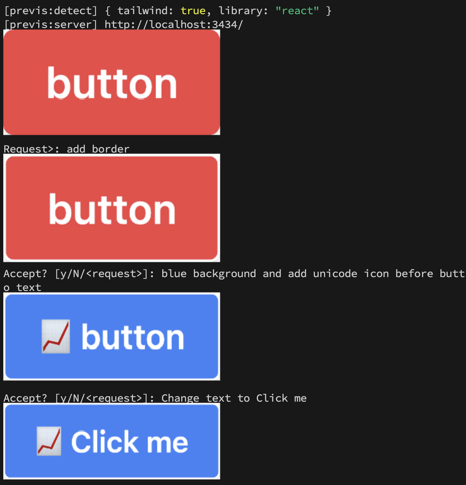

# previs

Interactive AI markup for frontend developpers.



## Install

Install deno https://docs.deno.com/runtime/manual/getting_started/installation

```bash
$ deno install -Af https://deno.land/x/previs@0.1.3/previs.ts
```

## Requirements

To preview in vscode terminal, you need imgcat and vscode settings.

### imgcat

```bash
# cd under PATH
$ wget https://iterm2.com/utilities/imgcat
$ chmod +x imgcat
```

### vscode

Launch command palette then `Preferences: Open User Settings (JSON)`

```jsonc
{
  // ...
  "terminal.integrated.enableImages": true,
}
```


## How to use

Previs works on vite project.

```bash
$ npm create vite@latest
# I recommend react-ts template
# cd <proj>
```

(TODO: previs use vite but ignore project's vite.config.*)

Set `PREVIS_OPENAI_API_KEY`.

```bash
$ export PREVIS_OPENAI_API_KEY=...
# or OPENAI_API_KEY
```


Check with `previs doctor`.

```bash
$ previs doctor
✅ git
✅ code
✅ imgcat
✅ bat
✅ PREVIS_OPENAI_API_KEY is set
✅ vite: ./vite.config.mts
✅ package.json: ./package.json
✅ tsconfig.json: ./tsconfig.json
✅ compilerOptions.jsx: react-jsx
Library: react
Base: ./
```

Run preview and fix interactively.

```bash
# Fix
$ previs src/button.tsx

# Fix with import (for tailwind and others)
$ previs src/button.tsx --import style.css

# Fix with image upload (CAUTION: many token used)
$ previs src/button.tsx --vision

# Preview with size
$ previs src/button.tsx -W 400px

# Generate new file
$ previs newfile.tsx

# Fix with test validation
$ previs src/button.tsx -- pnpm vitest --run __FILE__
```

### Previs preview convension (React)

Put single file for preview in vite project.

1. exported `__PREVIEW__`
  - `export function __PREVIEW__(/* shoud be non-props component */) {}`
2. Same symbol of filename(caseless)
  - `Button.tsx` => `export function Button() {...}`
3. exported `default`
  - `export default function App() {...}`

### Run with test

```bash
# run after -- command before code accept and retry.
$ previs button.tsx -- pnpm vitest --run __FILE__
```

`__FILE__` is replaced to generated temp file. (eg. `button.__previs__.tsx`)

## How it works

- Create temporal `vite` porject under `.previs-*`
- Run `vite` server in deno
- Run `puppeteer` and take screenshot
- Print screenshot by imgcat and `vscode` terminal image integration
- Build prompt with current code and fixing request
- Send prompt to openai api to generate new code
- Print screenshot again
- `previs <options> -- [test-command]`: Run test and retry automatically
- `previs --vision`: Send screenshot to openai
- Accepet generated code or add additional request

## TODO

- Commands
  - [x] previs
  - [x] previs fix
  - [x] previs doctor
  - [ ] previs init
- Integration
  - [x] react
  - [ ] svelte
  - [ ] vue
  - [ ] qwik
  - [ ] preact
  - [ ] astro
  - [ ] htmx
- Auto Detection
  - [x] UI library auto detection
  - [x] tailwind auto detection
  - [x] file named component detection
  - [ ] panda-css
  - [ ] ChakraUI
- [x] load tailwind config
- [x] format
- [ ] Load custom vite.config
- [ ] Zero config tailwind
- [ ] Load `previs.config.json`
- [x] width/height
- [x] show diff
- [ ] Autoload src/index.css
- [ ] Web UI
- [ ] VRT
- [ ] testing library sample
- Node package
  - [ ] @previs/helper

## LICENSE

MIT